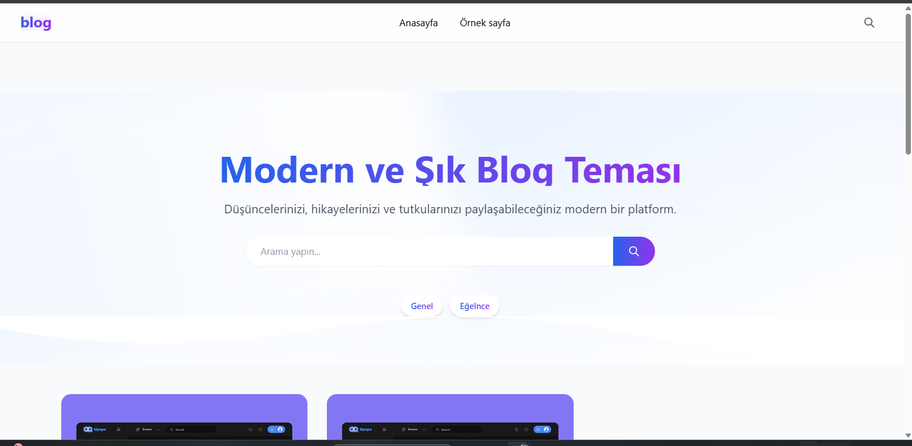

# BlogSR10 - Modern WordPress Blog Teması 🚀

## 🌟 Özellikler

### 📱 Responsive Tasarım
- Tüm cihazlarda mükemmel görünüm
- Mobil öncelikli tasarım
- Esnek grid sistemi
- Tailwind CSS ile modern UI

### 🎨 Modern Görsel Öğeler
- Gradient renkler ve animasyonlar
- Şık gölge efektleri
- Yumuşak geçişler
- Hover animasyonları
- Modern ikonlar ve butonlar

### 📝 Blog Özellikleri
- Öne çıkan görsel desteği
- Kategori ve etiket sistemi
- Okuma süresi göstergesi
- Yazar kutusu
- Sosyal medya paylaşım butonları
- SEO dostu yapı

### 💬 Gelişmiş Yorum Sistemi
- Modern yorum formu
- Yanıtlama özelliği
- Yorum moderasyon desteği
- AJAX yükleme
- Animasyonlu bildirimler

### 🔍 Arama Özellikleri
- Animasyonlu arama overlay'i
- Anlık arama sonuçları
- Gelişmiş arama filtresi
- Klavye kısayolu desteği (ESC ile kapatma)

### 📊 İçerik Düzeni
- 3 sütunlu grid sistem
- Lazy loading desteği
- Sonsuz kaydırma
- Kategorize edilmiş içerik
- Özelleştirilebilir widget alanları

### 🎯 Performans
- Optimize edilmiş kod yapısı
- Hızlı sayfa yükleme
- Minimal CSS ve JS kullanımı
- Önbellek dostu yapı

### 🛠 Teknik Özellikler
- WordPress 6.0+ uyumlu
- PHP 7.4+ desteği
- Tailwind CSS framework
- Modern ES6+ JavaScript
- SVG ikon desteği

## 📦 Kurulum

1. WordPress yönetim paneline giriş yapın
2. Görünüm > Temalar > Yeni Ekle'ye tıklayın
3. "Tema Yükle" butonuna tıklayın
4. BlogSR10.zip dosyasını seçin ve yükleyin
5. "Etkinleştir" butonuna tıklayın

## 🔧 Özelleştirme

### Tema Ayarları
- WordPress özelleştirici ile kolay düzenleme
- Özel logo yükleme
- Renk şeması seçimi
- Font ayarları
- Header ve footer düzenleme

### Widget Alanları
- Sidebar widget alanı
- Footer widget alanları (3 bölüm)
- Özel widget stilleri

## 📱 Mobil Uyumluluk

| Cihaz | Destek |
|-------|--------|
| Desktop | ✅ |
| Tablet | ✅ |
| Mobil | ✅ |
| Retina Ekran | ✅ |

## 🎨 Renk Paleti

- Primary: `#2563eb` (Blue-600)
- Secondary: `#9333ea` (Purple-600)
- Text: `#111827` (Gray-900)
- Background: `#f9fafb` (Gray-50)
- Accent: Gradient (Blue-600 to Purple-600)

## 🚀 Performans İyileştirmeleri

- Optimize edilmiş görseller
- Minimal CSS çıktısı
- Defer JavaScript yükleme
- Önbellek dostu yapı
- Lazy loading desteği

## 📋 Gereksinimler

- WordPress 6.0 veya üzeri
- PHP 7.4 veya üzeri
- MySQL 5.6 veya üzeri
- Modern web tarayıcısı

## 🔄 Güncellemeler

### Versiyon 1.0.0
- İlk sürüm yayınlandı
- Tüm temel özellikler eklendi
- Modern tasarım entegre edildi
- Yorum sistemi geliştirildi
- Arama özelliği eklendi

## 🤝 Destek

Herhangi bir sorun veya öneriniz için:
- 📧 E-posta: destek@blogsr10.com
- 💬 GitHub Issues
- 📝 WordPress.org forum

## 📜 Lisans

Bu tema MIT lisansı altında lisanslanmıştır.

---

### 🌟 Özel Teşekkürler

- Tailwind CSS ekibine
- WordPress topluluğuna
- Tüm katkıda bulunanlara

---

Made with ❤️ in Turkey 
